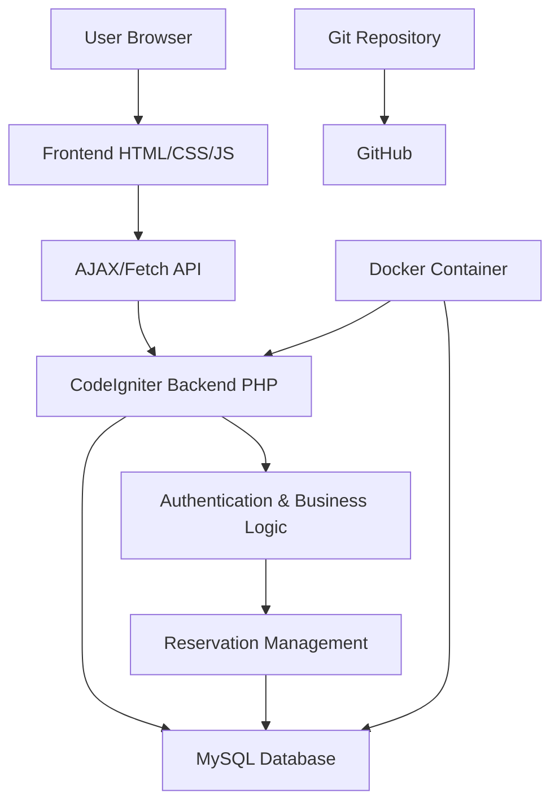

# Online Reservation Manager for Small Businesses

## Project Overview
This is a full-stack web application built as a professional portfolio project. It allows small businesses to manage online reservations efficiently. The system supports user registration, an interactive booking calendar, and an admin panel for managing reservations.

## Features
- **User Registration and Login**: Secure authentication for customers and admins.
- **Booking Calendar**: Interactive calendar for viewing and making reservations.
- **Admin Dashboard**: Panel for business owners to manage reservations, view reports, and handle user accounts.
- **Responsive Design**: Works seamlessly on desktop, tablet, and mobile devices.
- **Security**: Basic input validation, CSRF protection, and secure password handling.

## Technology Stack
- **Backend**: PHP with CodeIgniter framework
- **Frontend**: HTML, CSS, JavaScript (responsive design)
- **Database**: MySQL
- **Containerization**: Docker
- **Version Control**: Git

## Requirements
### Functional Requirements
1. Users can register and log in to the system.
2. Customers can view available time slots on a calendar and make reservations.
3. Admins can view, approve, reject, or cancel reservations.
4. Admins can manage user accounts and view reservation statistics.
5. The system prevents double-bookings and validates reservation data.

### Non-Functional Requirements
1. Responsive design for all device types.
2. Secure handling of user data and authentication.
3. Fast loading times and intuitive user interface.
4. Easy deployment using Docker.

## System Architecture


### Architecture Explanation
- **Frontend**: Handles user interactions, displays calendar, and communicates with backend via API calls.
- **Backend**: Processes requests, manages business logic, and interacts with the database.
- **Database**: Stores user information, reservations, and business data.
- **Docker**: Provides containerized environment for easy development and deployment.

## User Stories
1. As a customer, I want to register an account so I can make reservations.
2. As a customer, I want to view available time slots on a calendar so I can choose when to book.
3. As an admin, I want to approve or reject reservation requests so I can manage my business schedule.
4. As an admin, I want to view all reservations in a dashboard so I can track my business performance.

## Installation and Setup

### Prerequisites
- Docker and Docker Compose
- Git

### Quick Start
1. Clone the repository:
   ```bash
   git clone <repository-url>
   cd reservation-manager
   ```

2. Start the application with Docker:
   ```bash
   docker-compose up -d
   ```

3. Access the application:
   - Frontend: http://localhost:8080
   - Database: localhost:3306 (user: appuser, password: apppassword)

### Manual Setup (without Docker)
1. Install PHP 8.1+ with MySQL extension
2. Install Composer
3. Install CodeIgniter dependencies:
   ```bash
   composer install
   ```
4. Set up MySQL database and import `database/schema.sql`
5. Configure database connection in `app/Config/Database.php`
6. Start PHP server:
   ```bash
   php spark serve
   ```

### Default Credentials
- Admin: admin@example.com / password (change after first login)
- User: customer@example.com / password

## API Documentation
### Authentication Endpoints
- `POST /auth/login` - User login
- `POST /auth/register` - User registration
- `GET /auth/logout` - User logout

### Reservation Endpoints
- `GET /reservations` - List user's reservations
- `POST /reservations/create` - Create new reservation
- `POST /reservations/edit/{id}` - Update reservation
- `GET /reservations/delete/{id}` - Delete reservation
- `GET /api/reservations/{businessId}/{date}` - Get reservations for business on date

### Admin Endpoints
- `GET /admin/dashboard` - Admin dashboard
- `GET /admin/reservations` - List all reservations
- `POST /admin/reservations/update-status/{id}` - Update reservation status
- `GET /admin/businesses` - List businesses
- `POST /admin/businesses/create` - Create business
- `GET /admin/users` - List users

## Contributing
This is a portfolio project. Feel free to fork and modify for your own use.

## License
MIT License
